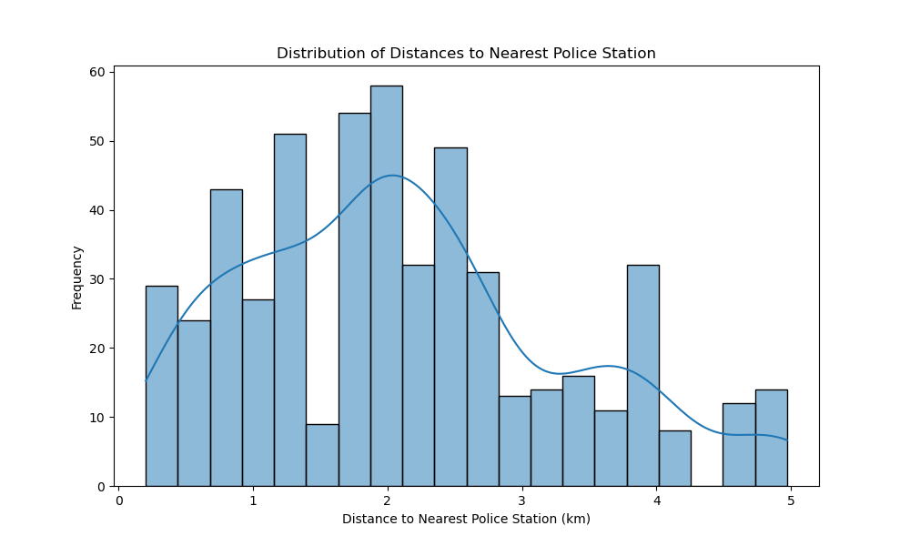

# Western United States Credit Card Analysis

## Dataset Provided

https://www.kaggle.com/datasets/neharoychoudhury/credit-card-fraud-data

This dataset consists of credit card transactions in the western United States. It includes information about each transaction including customer details, the merchant and category of purchase, and whether or not the transaction was a fraud.

## Fraud Analysis:

- What percentage of transactions are fraudulent?
- What is the timeline of this transaction data? 
- Are there certain merchants or categories with a higher incidence of fraud?
- Is there a relationship between transaction amount and fraud likelihood?

## Demographic Insights:

- What cardholder age group correlates with the likelihood of fraud?

## Geographical Trends:

- Which States have the highest number of fraudulent transactions?
- Is there a pattern in the geographical location of fraudulent transactions relative to the cardholder's location?

## Temporal Patterns:

- Are there specific month-year combinations with higher instances of fraud?

## Transaction Characteristics:

- How do transaction amounts differ between fraudulent and non-fraudulent transactions?
- Are certain transaction categories more prone to fraud?

## Police Station Location proximity to fraudulent transaction location:

- Is there a significant distance between fraudulent transactions and closest police station location?

# Group 3 Tasks 

## Step 1: Set Up the Environment

### Create a Jupyter Notebook:

- Establish a shared Jupyter Notebook environment in VS Code. 

### Import Necessary Libraries:

- Ensure all team members have access to required libraries: `pandas`, `numpy`, `matplotlib.pyplot`, `matplotlib.patches`, `seaborn`, `hvplot.pandas`, `panel`, `datetime`, `statsmodels.api`, and `requests`.
- Install any additional libraries needed for the analysis.

### Load the Dataset:

- Load the dataset into the notebook using `pandas`.
- Utilize VS Code version control branching to provide code using branching. 

## Step 2: Assign Tasks

### Task 1: Data Cleaning and Preprocessing (Micah)

- Check for missing values and handle them appropriately.
- Ensure data types are correct, such as converting date columns to datetime format.
- Remove any duplicate entries if necessary.

- **Descriptive Statistics:** Summarize the dataset using descriptive statistics (mean, median, mode, etc.) to understand the data distribution and detect any anomalies or outliers.

### Task 2: Calculate Percentage of Fraudulent Transactions (Kim)

- Calculate the percentage of transactions that are fraudulent by comparing the number of fraudulent transactions to the total number of transactions.

- **Bar Chart:** Use a bar chart to show the proportion of fraudulent versus non-fraudulent transactions by category. This provides a clear visual representation of the percentage of fraud.

- **Bar Chart:** Use a bar chart to show the proportion of fraudulent versus non-fraudulent transactions by state. This provides a clear visual representation of the percentage of fraud.

### Task 3: Analyze the Timeline of Transactions (Michael)

- Create a **Timeline Series Line Plot** of the transaction data to observe trends over time, focusing on identifying any patterns or changes in fraudulent average transaction amounts. 

- **Time Series Line Plot:** Create a line plot showing the volume of transactions over time. This can help identify trends, seasonality, or any sudden spikes in transaction volume. Do so by (Month-Year) data-points. 

- **Patterns:** Look for seasonal trends (by season), around holidays and COVID shutdown trends. 

### Task 4: Analyze Merchants and Categories with Higher Fraud Incidence (Joseph & Micah)

- Identify which top 10 merchants have the highest rates of fraud by calculating fraud incidences for each. Also capture the categories of these merchants and the states where the frauds occured.    

- **Bar Chart:** Create bar chart to display the fraud count for each top 10 merchant. This helps to illustrate the distribution of fraudulent transactions across merchants. By color-coding the bars according to the merchants' categories, the plot also provides insight into which categories of merchants are more frequently involved in fraudulent activities. 

- **Bar Chart:** Create bar charts to display the percentage make-up of fraudulent transactions per state and category. 

- **Box Plot Wisker Chart:** Create a wisker box plot chart to show the distribution of fraud counts per merchant in the dataset. 

- **Map Plot:** visualizes data on fraudulent transactions across different geographic locations. This provides insights into where fraud is most concentrated by displaying the number of fraudulent transactions and total transaction amounts on an interactive map, with the ability to distinguish between different states through color coding. This is useful for identifying geographic hotspots of fraudulent activity and understanding regional patterns.

(REFER TO VISUALIZATION MAP INSIDE JUPYTER NOTEBOOK)

### Task 5: Analyze Relationship Between Transaction Amount and Fraud Likelihood (Sergei)

- Analyze the distribution of transaction amounts for fraudulent versus non-fraudulent transactions.

- Use statistical tests or visualizations to explore any relationships between transaction amount and the likelihood of fraud.

- **Scatter Plot** plot age grouping and mean of fraudelent amounts. 

- **Box Plot :** Use box plot to compare the distribution of transaction amounts between fraudulent and non-fraudulent transactions. 

### Task BONUS: Analyze Relationship between Geopafy API and dataset (Sergei)

- Using Geopafy API, locate closest police station to dataset merchant location and measure distance. 

- Create a ** Histogram** to display the distribution of distances from merchant locations to the nearest police station. This will provide a straightforward view of how these distances vary across the dataset.

## Step 3: Collaborate and Document Findings

### Combine Analysis: README File and Project Tracking (Sergei)

- Compile each member's findings into the shared Jupyter Notebook.

### Interpret Results: (Team Collaboration)

- Provide a brief interpretation of findings for each section of the analysis.

### Document Insights: (Sergei)

- Summarize major insights from each analysis section to highlight key findings.

### Review and Present: (Team Collaboration)

- Review the notebook together to ensure clarity and correctness.
- Prepare a presentation that highlights the key findings and implications.

## Step 4: Additional Steps for Presentation

### Create Visualizations: (Task Analysis Specific)

- Develop polished charts and graphs using `matplotlib` or `hvplot` for inclusion in the presentation.

### Develop Presentation Slides: (Kim)

- Use presentation software PowerPoint to create slides that capture key points and visualizations.

### Rehearse Presentation: (Team Collaboration)

- Each team member presents their section of the analysis to ensure a smooth delivery.